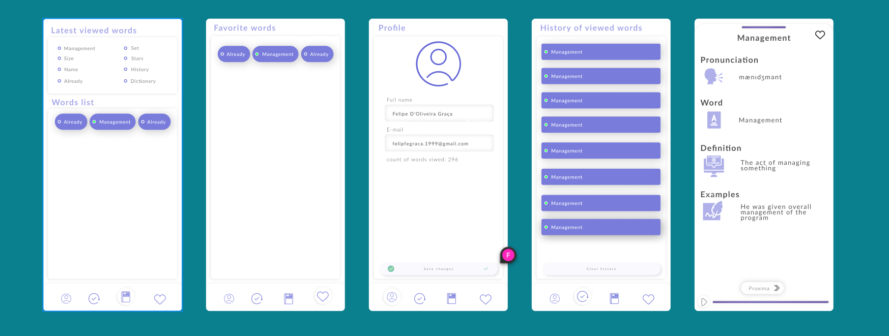

# English dictionary

<!-- Create a complete descript -->
This application is a simple english dictionary application built using flutter framework. This application is built using BLoC pattern, Clean Architecture, TDD, and SOLID principle.

## Screenshots
- Figma design(UI/UX) created by me



## Packages and usage

#### Dependency injection
- [get_it](https://pub.dev/packages/get_it) - For dependency injection

#### Equatablity and state management
- [equatable](https://pub.dev/packages/equatable) - For equality comparison
- [flutter_bloc](https://pub.dev/packages/flutter_bloc) - For state management

#### Rest Service
- [dio](https://pub.dev/packages/dio) - For http request
- [pretty_dio_logger](https://pub.dev/packages/pretty_dio_logger) - For logging http request

#### Local storage
- [shared_preferences](https://pub.dev/packages/shared_preferences) - For local storage

#### TTS (Text to speech)
- [flutter_tts](https://pub.dev/packages/flutter_tts) - For text to speech

#### Functional programming
- [dartz](https://pub.dev/packages/dartz) - For functional programming

#### Back-end
- [firebase_auth](https://pub.dev/packages/firebase_auth) - For authentication
- [firebase_core](https://pub.dev/packages/firebase_core) - For firebase core
- [cloud_firestore](https://pub.dev/packages/cloud_firestore) - For firebase firestore

#### UI
- [flutter_svg](https://pub.dev/packages/flutter_svg) - For svg image
- [google_fonts](https://pub.dev/packages/google_fonts) - For google fonts
- [vibration](https://pub.dev/packages/vibration) - For vibration effect
- [modal_bottom_sheet](https://pub.dev/packages/modal_bottom_sheet) - For bottom sheet

#### Testing
- [mockito](https://pub.dev/packages/mockito) - For mocking object
- [build_runner](https://pub.dev/packages/build_runner) - For mockito code generation


## Architecture
    - lib
        - core
            - errors
            - features
                - cubit
                - data
                    - datasources
                    - models
                    - repositories
                - domain
                    - entities
                    - repositories
                    - usecases
            - routes
            - usecase
            - utils
            - services
            - shared
        - presenter
            - features
                - cubit
                - data
                    - datasources
                    - models
                    - repositories
                - domain
                    - entities
                    - repositories
                    - usecases
                - pages
                    - widgets
        - ui
            - global
                - custom_components
                    - widgets
                    - cubit
        - main.dart
                

## APIS
- [wordsapi](https://www.wordsapi.com/)
- [firebase](https://firebase.google.com/)

## Features
- [x] Login with google
- [X] List of words
- [X] Favorite words
- [X] History words
- [X] Total of viewed words
- [x] Profile
- [X] Lastest viewed words
- [X] Search words

## Testing
- [X] Unit Testing


## Requirements
- [Flutter](https://flutter.dev/docs/get-started/install) 3.10.5
- [Dart](https://dart.dev/) sdk: '>=3.0.5 <4.0.0'
- [Android SDK](https://developer.android.com/studio)


## Getting Started

### 1. Clone the repository

```shell
$ git clone
$ cd english_dictionary
```

### 2. Get the packages

```shell
$ flutter pub get
```

### 3. Active code generation

```shell
$ flutter pub run build_runner watch --delete-conflicting-outputs
```

- You need run this command what ever you change the code in test folder [Mockito]


### 4. Run the app

```shell
$ flutter run --dart-define=WORD_SIGNIFICATION_API_KEY=[YOUR_API_KEY] --dart-define=WORD_SIGNIFICATION_API_URL=https://wordsapiv1.p.rapidapi.com/words
```

